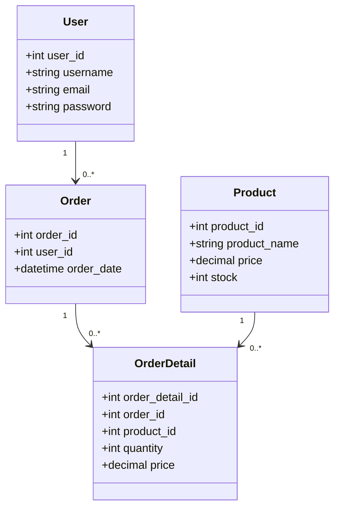

# Отчет по проекту "Минимаркет, товары"

## 1. Предметная область

**Описание:**
Минимаркет представляет собой небольшой магазин, предлагающий разнообразные товары повседневного спроса. В данном проекте реализована система управления товарами и заказами, которая позволяет эффективно управлять запасами, процессом заказов и данными клиентов.

**Проблема:**
Одна из ключевых проблем в данной предметной области — это эффективное управление запасами и заказами. Мелкие магазины часто сталкиваются с трудностями в отслеживании остатков товаров, обработке заказов и учете данных о клиентах. Отсутствие автоматизации может приводить к ошибкам в учете, потере данных и неудовлетворенности клиентов.

## 2. Постановка задачи

**Методы решения:**
Для решения обозначенных проблем предлагается разработка клиент-серверного приложения, которое позволит:
- Управлять данными о пользователях (создание, чтение, обновление, удаление).
- Управлять данными о товарах (создание, чтение, обновление, удаление).
- Управлять данными о заказах (создание, чтение, обновление, удаление).
- Управлять данными о деталях заказов (создание, чтение, обновление, удаление).
- Обеспечить RESTful API для взаимодействия с клиентскими приложениями.

**Функциональные возможности:**
- **Пользователи:** Регистрация новых пользователей, обновление данных о пользователях, удаление пользователей.
- **Товары:** Добавление новых товаров, обновление информации о товарах, удаление товаров, проверка доступности товаров.
- **Заказы:** Создание новых заказов, обновление информации о заказах, удаление заказов.
- **Детали заказов:** Добавление деталей заказа, обновление информации о деталях заказа, удаление деталей заказа.

## 3. Описание архитектуры

**Архитектура:**
Приложение разработано с использованием архитектуры клиент-сервер. Серверная часть реализована на Python с использованием Flask для создания API и SQLAlchemy для работы с базой данных. Клиентская часть может быть реализована в виде веб-приложения или мобильного приложения, взаимодействующего с сервером через API.

**Основные сущности и их обязанности:**
- **User (Пользователь):** Сущность, представляющая пользователя системы. Включает информацию о имени пользователя, email и пароле.
- **Product (Товар):** Сущность, представляющая товар. Включает информацию о названии товара, цене и количестве на складе.
- **Order (Заказ):** Сущность, представляющая заказ. Включает информацию о пользователе, сделавшем заказ, и дате заказа.
- **OrderDetail (Детали заказа):** Сущность, представляющая детализированную информацию о заказе. Включает информацию о товаре, количестве и общей стоимости.

## 4. Описание структуры базы данных

**Основные сущности:**
- **User (Пользователь):**
  - user_id (int, primary key): Уникальный идентификатор пользователя.
  - username (string): Имя пользователя.
  - email (string): Email пользователя.
  - password (string): Пароль пользователя.

- **Product (Товар):**
  - product_id (int, primary key): Уникальный идентификатор товара.
  - product_name (string): Название товара.
  - price (decimal): Цена товара.
  - stock (int): Количество товара на складе.

- **Order (Заказ):**
  - order_id (int, primary key): Уникальный идентификатор заказа.
  - user_id (int, foreign key): Идентификатор пользователя, сделавшего заказ.
  - order_date (datetime): Дата заказа.

- **OrderDetail (Детали заказа):**
  - order_detail_id (int, primary key): Уникальный идентификатор детали заказа.
  - order_id (int, foreign key): Идентификатор заказа.
  - product_id (int, foreign key): Идентификатор товара.
  - quantity (int): Количество товара.
  - price (decimal): Общая стоимость.

**Взаимосвязи между сущностями:**
- Один пользователь может иметь множество заказов (связь один ко многим).
- Один заказ может включать множество деталей заказов (связь один ко многим).
- Один товар может быть частью множества деталей заказов (связь один ко многим).

**Графическое представление схемы базы данных:**

```mermaid
erDiagram
    USER {
        int user_id PK
        string username
        string email
        string password
    }

    PRODUCT {
        int product_id PK
        string product_name
        decimal price
        int stock
    }

    ORDER {
        int order_id PK
        int user_id FK
        datetime order_date
    }

    ORDER_DETAIL {
        int order_detail_id PK
        int order_id FK
        int product_id FK
        int quantity
        decimal price
    }

    USER ||--o{ ORDER : has
    ORDER ||--o{ ORDER_DETAIL : contains
    PRODUCT ||--o{ ORDER_DETAIL : part_of


classDiagram
    class User {
        +int user_id
        +string username
        +string email
        +string password
    }

    class Product {
        +int product_id
        +string product_name
        +decimal price
        +int stock
    }

    class Order {
        +int order_id
        +int user_id
        +datetime order_date
    }

    class OrderDetail {
        +int order_detail_id
        +int order_id
        +int product_id
        +int quantity
        +decimal price
    }

    User "1" --> "0..*" Order
    Order "1" --> "0..*" OrderDetail
    Product "1" --> "0..*" OrderDetail
```


## 5. Описание серверной части

### Диаграмма классов:




### Основные сущности и их назначение:

#### Модели:

**User (Пользователь):**

- **Атрибуты:**
  - `user_id` (int, primary key): Уникальный идентификатор пользователя.
  - `username` (string): Имя пользователя.
  - `email` (string): Email пользователя.
  - `password` (string): Пароль пользователя.

- **Пример кода:**
  ```python
  class User(db.Model):
      user_id = db.Column(db.Integer, primary_key=True)
      username = db.Column(db.String(50), nullable=False)
      email = db.Column(db.String(100), nullable=False, unique=True)
      password = db.Column(db.String(50), nullable=False)
  ```

## Product (Товар):

### Атрибуты:

- `product_id` (int, primary key): Уникальный идентификатор товара.
- `product_name` (string): Название товара.
- `price` (decimal): Цена товара.
- `stock` (int): Количество товара на складе.

### Пример кода:

```python
class Product(db.Model):
    product_id = db.Column(db.Integer, primary_key=True)
    product_name = db.Column(db.String(100), nullable=False)
    price = db.Column(db.Numeric(10, 2), nullable=False)
    stock = db.Column(db.Integer, nullable=False)

    @validates('price', 'stock')
    def validate_positive(self, key, value):
        if value < 0:
            raise ValueError(f"{key} must be positive.")
        return value
 ```
 
 ## Order (Заказ):

### Атрибуты:

- `order_id` (int, primary key): Уникальный идентификатор заказа.
- `user_id` (int, foreign key): Идентификатор пользователя, сделавшего заказ.
- `order_date` (datetime): Дата заказа.

### Пример кода:

```python
class Order(db.Model):
    order_id = db.Column(db.Integer, primary_key=True)
    user_id = db.Column(db.Integer, db.ForeignKey('user.user_id'), nullable=False)
    order_date = db.Column(db.DateTime, default=func.current_timestamp(), nullable=False)
```
## OrderDetail (Детали заказа):

### Атрибуты:

- `order_detail_id` (int, primary key): Уникальный идентификатор детали заказа.
- `order_id` (int, foreign key): Идентификатор заказа.
- `product_id` (int, foreign key): Идентификатор товара.
- `quantity` (int): Количество товара.
- `price` (decimal): Общая стоимость.

### Пример кода:

```python
class OrderDetail(db.Model):
    order_detail_id = db.Column(db.Integer, primary key=True)
    order_id = db.Column(db.Integer, db.ForeignKey('order.order_id'), nullable=False)
    product_id = db.Column(db.Integer, db.ForeignKey('product.product_id'), nullable=False)
    quantity = db.Column(db.Integer, nullable=False)
    price = db.Column(db.Numeric(10, 2), nullable=False)

    @validates('quantity')
    def validate_quantity(self, key, value):
        if value < 0:
            raise ValueError(f"{key} must be positive.")
        return value

    @validates('price')
    def validate_price(self, key, value):
        product = Product.query.get(self.product_id)
        return product.price * self.quantity
```

## Контроллеры:

**UserController:** Обрабатывает операции, связанные с пользователями (создание, чтение, обновление, удаление).

### Пример кода:

```python
@ns_users.route('/')
class UserList(Resource):
    @ns_users.expect(user_model)
    def post(self):
        data = request.json
        min_user_id = get_min_available_id(User, User.user_id)
        new_user = User(user_id=min_user_id, username=data['username'], email=data['email'], password=data['password'])
        db.session.add(new_user)
        db.session.commit()
        return jsonify({'message': 'User created successfully'}), 201
 ```

**ProductController:** Обрабатывает операции, связанные с товарами (создание, чтение, обновление, удаление).

### Пример кода:

```python
@ns_products.route('/')
class ProductList(Resource):
    @ns_products.expect(product_model)
    def post(self):
        data = request.json
        min_product_id = get_min_available_id(Product, Product.product_id)
        new_product = Product(product_id=min_product_id, product_name=data['product_name'], price=data['price'], stock=data['stock'])
        db.session.add(new_product)
        db.session.commit()
        return jsonify({'message': 'Product created successfully'}), 201
```
**OrderController:** Обрабатывает операции, связанные с заказами (создание, чтение, обновление, удаление).

### Пример кода:

```python
@ns_orders.route('/')
class OrderList(Resource):
    @ns_orders.expect(order_model)
    def post(self):
        data = request.json
        min_order_id = get_min_available_id(Order, Order.order_id)
        new_order = Order(order_id=min_order_id, user_id=data['user_id'])
        db.session.add(new_order)
        db.session.commit()
        return jsonify({'message': 'Order created successfully'}), 201
```

**OrderDetailController:** Обрабатывает операции, связанные с деталями заказов (создание, чтение, обновление, удаление).

### Пример кода:

```python
@ns_order_details.route('/')
class OrderDetailList(Resource):
    @ns_order_details.expect(order_detail_model)
    def post(self):
        data = request.json
        min_order_detail_id = get_min_available_id(OrderDetail, OrderDetail.order_detail_id)
        product = Product.query.get_or_404(data['product_id'])
        total_price = product.price * data['quantity']
        new_order_detail = OrderDetail(order_detail_id=min_order_detail_id, order_id=data['order_id'], product_id=data['product_id'], quantity=data['quantity'], price=total_price)
        db.session.add(new_order_detail)
        db.session.commit()
        return jsonify({'message': 'Order detail created successfully'}), 201
```
## 6. Описание клиентской части

### Элементы интерфейса для конечного пользователя (в случае наличия GUI):

Если в проекте имеется графический интерфейс пользователя (GUI), необходимо описать основные элементы интерфейса и их назначение. Например:

- **Главная страница:** Отображает приветственное сообщение и общую информацию о сервисе.
 
- **Страница управления пользователями:** Позволяет администраторам создавать, обновлять и удалять пользователей.

- **Страница управления товарами:** Позволяет администраторам добавлять новые товары, обновлять информацию о товарах и удалять товары.

- **Страница заказов:** Позволяет пользователям просматривать свои заказы и создавать новые заказы.

- **Страница деталей заказа:** Отображает информацию о выбранном заказе, включая товары, их количество и общую стоимость.

### Спецификация API:

Если пользовательский интерфейс отсутствует, необходимо предоставить спецификацию на предоставляемое приложением API. Ниже приведены примеры API-запросов и их тестирование.

### Пример API-запросов:

#### Создание пользователя:
```http
POST /users/
{
    "username": "user1",
    "email": "user1@example.com",
    "password": "password"
}
```
### Получение списка товаров:

```http
GET /products/
```

### Создание заказа:

```http
POST /orders/
{
    "user_id": 1
}
```

### Добавление деталей заказа:

```http
POST /order_details/
{
    "order_id": 1,
    "product_id": 2,
    "quantity": 3
}
```


## 7. Пример работы приложения

### Таблицы в базе данных

Наше приложение использует следующие таблицы в базе данных:

1. **Users (Пользователи)**

2. **Products (Товары)**

3. **Orders (Заказы)**

4. **OrderDetails (Детали заказов)**


### Внесение изменений и проверка работы приложения

1. **Добавим нового пользователя - example в таблицу `Users`**:
   - Добавим пользователя с именем `example`.


2. **Проверим, как работает поиск по `user_id` и обновляется ли наша БД в режиме реального времени**:
   - Выполним поиск пользователя по `user_id` и убедимся, что изменения сразу отражаются в базе данных.

3. **Удалим один товар из таблицы `Products`**:
   - Удалим товар из базы данных.

4. **Создадим новый заказ в таблице `Orders`**:
   - Создадим заказ для пользователя.

5. **Добавим информацию о новом заказе в таблицу `OrderDetails`**:
   - Добавим детали заказа, указав количество и стоимость товаров.


#### Теперь посмотрим, как изменилась наша база данных:

- В таблице `Users` отобразился новый пользователь.
- В таблице `Products` удалился один товар.
- В таблице `Orders` добавился новый заказ.
- В таблице `OrderDetails` добавилась информация о новом заказе.
